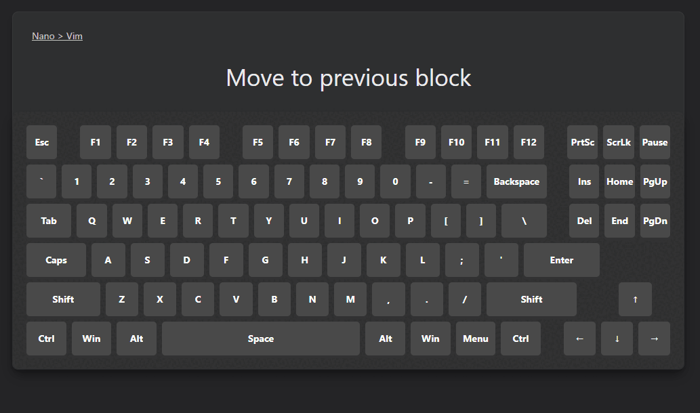

<i>Make shortcut learning a breeze</i> 

# Features

- **Interactive Virtual Keyboard**: Displays a responsive keyboard layout directly in your Anki cards ⌨️
- **Real-time Key Visualization**: Highlights keys as you press them, providing immediate pretty visual feedback 🤩
- **Shortcut Validation**: Automatically checks if your entered key combination matches the expected shortcut ✅
- ~~**Customizable Layout**: Choose from various keyboard layouts to suit your needs ♻️~~
- ~~**Note Agostnic**: Works with any Anki note type 🎫~~
- ~~**Reversible**: Memorise what the shortcut is for from the keys highlighted 🤔~~

# Usage

Once you've installed the extension, a new note type should be automatically created for you. Cards follow the format:

- Front: [What the shortcut is for]
- Back: <kbd>Key1</kbd> <kbd>Key2</kbd> <kbd>Key3</kbd> <kbd>Key4</kbd>

When adding the `Back` field, it's imperative you only enter the key combination and nothing else, as this is how the validation works. (Unless you don't care about the validation, of course).

Each key should be separated by a space. For example, if the shortcut was to select all text, you would enter `Ctrl A`.

During review, to answer the card, tap the <kbd>Escape</kbd> key. If you've made a mistake and want to correct it, simply tap the <kbd>Backspace</kbd> key as required.

In the case that the addon breaks and key presses are not recongised/being sent to Anki, please restart the program.

# Installation
Zip the contents of src/ to package.apkg and import it into Anki. Altenrativley, download a pre-built package from the releases page.
